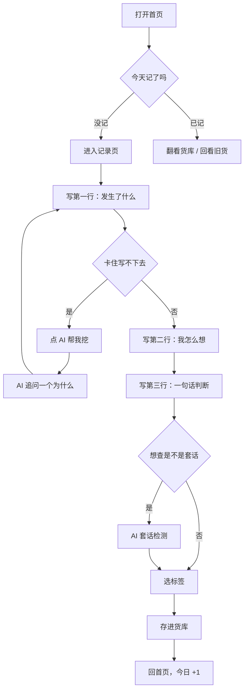

# 货库 · 表达训练系统 PRD

| 项目 | 内容 |
|---|---|
| 文档版本 | V1.0 |
| 日期 | 2026-08-23 |
| 状态 | 待评审（建议产品经理复核定稿） |
| 项目代号 | biaodaxunlian |

---

## §1 文档信息

### 1.1 基础信息

- **产品名称**：货库 · 表达训练系统
- **产品形态**：单人自用的 Web 应用（PC + 移动端响应式）
- **部署平台**：Vercel（前端静态 + Serverless Function 后端）

### 1.2 需求来源追溯

| 字段 | 内容 |
|---|---|
| 来源类型 | 用户自我诊断 |
| 来源人 | 老板（本人） |
| 来源场合 | 多轮一对一讨论（三视角辩证 → 第一性原理 → 3 分钟实测验证） |

---

## §2 背景与目标

### 2.1 背景

用户长期存在表达能力短板：脑子没货、说不出来、说话没逻辑、写东西慢、当众紧张、沟通吃亏、事后才反应过来。经多轮深度剖析与一次实测验证，确认**根因不在"输出技巧"（口才），而在"感知 + 思考"链路长期停摆**——用户自述「长期不开口、不思考、不感受」，导致"脑子里没货"。

实测证据：让用户挑一件当天真实小事回答"你怎么看、为什么"时，用户先"大脑一片空白"，费力挖出一件事后，说出的全是套话（"一日之计在于晨"等），没有一句自己的判断。

### 2.2 目标

做一个单人自用的**「货库」**：每天把一件真实小事，通过「发生了什么 → 我怎么想 → 一句话判断」三行，挖成一条属于自己的"货"，攒起来、定期回看、追踪连续性。以此重建「感知 → 加工 → 输出」的链路活力。

**核心命题**：表达能力的根，是「从生活里持续造货」的能力，不是「把货倒出来」的技巧。

---

## §3 目标用户与场景

### 3.1 目标用户

单人（老板本人）。无账号体系、无多用户，数据本地存储。

### 3.2 使用场景

| 场景 | 描述 |
|---|---|
| 日常造货 | 每天睡前（或碎片时间）回想一个真实瞬间，挖成三行记录 |
| 卡壳求助 | 写"我怎么想"写不下去时，点 AI 追问，帮自己往下挖 |
| 回看复习 | 1/3/7/14/30 天前的旧货自动浮现，重新看一眼 |
| 查看连续性 | 查看累计挖货数、连续天数、本月打卡日历 |

---

## §4 功能需求清单

> 优先级仅 P0-P2。功能编号 F01-F0N 连续。

| 编号 | 功能 | 优先级 | 说明 | 归属页面 | 接口归属 |
|---|---|---|---|---|---|
| F01 | 记货（造货三行） | P0 | 三行输入 + 标签，保存入库 | P02 记录页 | 前端本地 |
| F02 | 货库（历史翻看） | P0 | 时间倒序列表、标签筛选、删除 | P03 货库页 | 前端本地 |
| F03 | AI 造货教练 | P0 | 追问"为什么" + 套话检测，教练式不代答 | P02 记录页 | 后端 /api/coach |
| F04 | 回看（间隔复习） | P1 | 1/3/7/14/30 天前的货自动浮现 | P04 回看页 | 前端本地 |
| F05 | 进步（打卡日历） | P1 | 累计/连续天数 + 本月打卡日历 | P05 进步页 | 前端本地 |
| F06 | 数据导出备份 | P1 | JSON 一键导出/导入 | P05 进步页 | 前端本地 |

---

## §5 用户流程



---

## §6 页面清单 Page Map

| 页面编号 | 页面 | 承载功能 | 入口 | 数据传递 |
|---|---|---|---|---|
| P01 | 首页 | 今日统计、连续天数、各页入口 | 启动 | 读取本地历史 |
| P02 | 记录页 | F01 记货、F03 AI 教练 | 首页主按钮 | 写回本地历史 |
| P03 | 货库页 | F02 翻看/筛选/删除 | 首页 | 读取本地历史 |
| P04 | 回看页 | F04 间隔复习 | 首页 | 按日期过滤历史 |
| P05 | 进步页 | F05 打卡、F06 导出 | 首页 | 读取本地历史 |

---

## §7 交互说明

### 7.1 记货表单（F01）

- 三行均为必填，任一为空时"存进货库"按钮置灰
- 输入为多行文本域，支持换行
- 标签为单选（工作/生活/关系/自我/观点/其他），默认"生活"

### 7.2 AI 教练（F03）

- 「AI 帮我挖」：仅当第一行有内容、第二行为空时可用；点击后按钮进入加载态，返回一句追问，插入到第二行下方作为提示
- 「套话检测」：第三行有内容时可用；AI 判断是否套话，返回提示（如"这是别人的观点，你的呢？"）
- 教练式约束：只追问、只提示方向，**不替用户作答**

### 7.3 数据量级

- 单人使用，日均 1-3 条，年约 1000 条以内
- 历史列表上限 200 条（超出淘汰最旧）

---

## §8 数据要求

### 8.1 数据模型（localStorage）

```ts
interface HuoEntry {
  id: string          // UUID
  date: string        // 'YYYY-MM-DD'
  happened: string    // 第一行：发生了什么
  thought: string     // 第二行：我怎么想
  judgment: string    // 第三行：一句话判断
  tag: Tag            // 工作/生活/关系/自我/观点/其他
  createdAt: number   // 时间戳
}
```

存储键：`biaodaxunlian:history`，存 HuoEntry 数组。

### 8.2 数据持久化

浏览器 localStorage，纯前端零后端存储，无需数据库。

### 8.3 外部系统集成

| 系统 | 用途 | 集成方式 |
|---|---|---|
| DeepSeek API | AI 造货教练（追问+套话检测） | 后端 Serverless Function 代理调用 |

后端接口：

```
POST /api/coach
请求：{ mode: 'dig' | 'cliche', happened, thought, judgment }
响应：{ question: '...' } 或 { feedback: '...' }
```

- API Key 存于 Vercel 环境变量，前端代码零 Key
- 后端校验来源域名，防额度盗用

### 8.4 非功能性需求

- **响应式**：PC 与移动端均可用
- **离线可用**：记货、翻看、打卡等本地功能不依赖网络；仅 AI 教练需联网
- **性能**：本地数据操作 < 50ms，AI 调用 < 3s（超时提示重试）
- **安全**：数据本地私有，不传输个人记录到后端（仅 AI 教练提交当次输入内容）

---

## §9 非目标（明确不做）

- ❌ 语音识别 / 语音转文字
- ❌ AI 模拟对话（外包给 ChatGPT/豆包，用提示词实现）
- ❌ 词库分析 / 填充词检测 / 6 维评分
- ❌ 多用户 / 账号系统 / 权限体系
- ❌ 课程体系 / 素材库 / 排行榜
- ❌ 跨设备云同步（V1 阶段）

---

## §10 验收标准

### F01 记货
- Given 用户在记录页，When 三行均填写且选标签点击保存，Then 记录写入本地并跳转货库页
- Given 任一行为空，When 尝试保存，Then 保存按钮置灰不可点

### F02 货库
- Given 有历史记录，When 进入货库页，Then 按时间倒序展示全部记录
- Given 点击某标签筛选，When 列表刷新，Then 仅显示该标签记录
- Given 点击删除，When 确认删除，Then 该条记录移除

### F03 AI 教练
- Given 第一行有内容、第二行为空，When 点「AI 帮我挖」，Then 返回一条追问且不替用户作答
- Given 第三行有内容，When 点套话检测，Then 返回是否套话的提示
- Given 网络异常或 Key 未配，When 调 AI，Then 前端友好提示，本地记录功能不受影响

### F04 回看
- Given 1/3/7/14/30 天前有记录，When 进入回看页，Then 按间隔分组展示对应记录

### F05 进步
- Given 有历史记录，When 进入进步页，Then 正确显示累计数、连续天数、本月打卡日历

### F06 导出
- Given 点击导出，When 完成，Then 下载 JSON 文件含全部记录
- Given 点击导入，When 选择合法 JSON，Then 记录合并入库（去重）

### 边界场景
- 历史为空时，各页显示友好空状态引导
- 存储写满（200 条）时，自动淘汰最旧记录

---

## §11 成功指标

| 类型 | 指标 | 说明 |
|---|---|---|
| 北极星 | 连续挖货天数（streak） | 衡量"造货"习惯是否形成 |
| 核心 | 累计挖货数 | 货库规模 |
| 核心 | 周活跃天数 | 每周至少记一条的天数 |
| 辅助 | AI 教练使用次数 | 卡壳求助频率 |

---

## §12 风险与依赖

| 类型 | 内容 | 应对 |
|---|---|---|
| 依赖 | DeepSeek API 可用性 | 后端降级：AI 不可用时本地功能照常 |
| 风险 | API Key 泄露 | Key 仅存后端环境变量，前端零 Key |
| 风险 | 三分钟热度（习惯中断） | 打卡日历 + 连续天数形成正反馈 |
| 风险 | localStorage 数据丢失 | F06 JSON 导出备份（P1） |

---

## §13 附录

### 13.1 术语表

| 术语 | 含义 |
|---|---|
| 造货 | 把一件真实小事挖成"一句话判断"的过程 |
| 货库 | 攒下来的"货"的集合 |
| 三行 | 发生了什么 / 我怎么想 / 一句话判断 |

### 13.2 核心设计原则

- **教练式不代答**：AI 只追问、只提示方向，绝不替用户思考——否则违背"造货"初衷
- **治上游不治下游**：系统治"没货"（感知+思考），不治"说不好"（口才技巧）

### 13.3 与开源项目的借鉴关系

| 借鉴来源 | 借鉴内容 |
|---|---|
| chunfeng11221/expression-trainer（#2） | 存储层（localStorage 封装）、连续天数统计、页面骨架 |
| wokaka209/koucai-teacher（#5） | 艾宾浩斯间隔复习（1/3/7 天） |
| 13875892872/eloquence-camp（#4） | 打卡日历 + 成长激励设计 |
| #2 的 prep-hints 机制 | AI 教练"只给角度不给答案" |

### 13.4 测试要求

- 单元测试：连续天数计算（含跨天、跨月边界）
- 组件测试：记录页三行表单校验
- 手工走查：首页 → 记货 → 存库 → 翻看 → 回看 → 打卡全流程

---

> 说明：本文档为 Markdown 版。Word 版可在内容确认后生成（docx 能力）。
