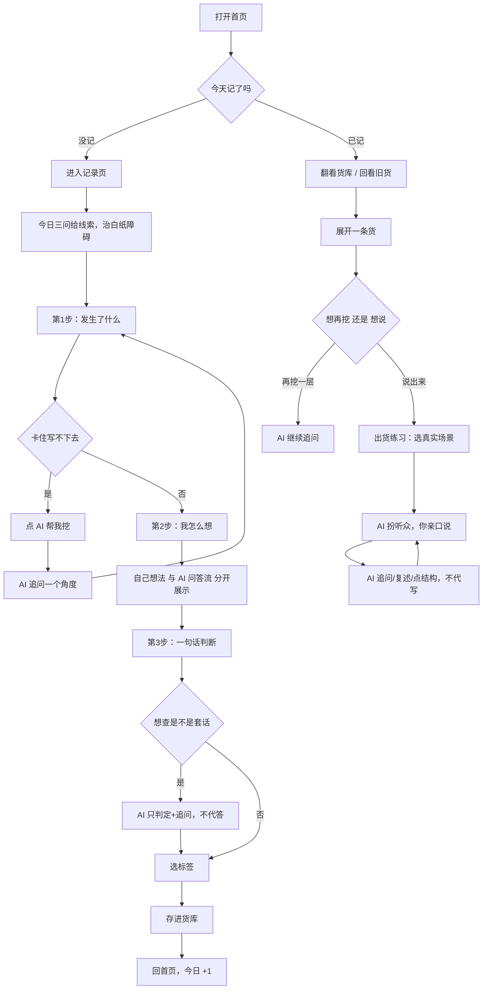

# 货库 · 表达训练系统 PRD

| 项目 | 内容 |
|---|---|
| 文档版本 | V2.0 |
| 日期 | 2026-09-08 |
| 状态 | 已实现（随开发迭代同步更新） |
| 项目代号 | biaodaxunlian |

> **V1.1 → V2.0 变更摘要**：核心命题从「只造货、不治说不好」升级为「造货 + 出货」完整闭环；新增 F09 出货练习（场景模拟、AI 当听众）；删除旧非目标「AI 模拟对话」并改为「AI 代写成稿」；记录页由「三行表单」改为「分步引导 + 今日三问」；货库由「只读列表」升级为「缩略卡片 + 展开再加工」。

---

## §1 文档信息

### 1.1 基础信息

- **产品名称**：货库 · 表达训练系统
- **产品形态**：自用的 Web 应用（PC + 移动端响应式），支持多账号
- **部署平台**：GitHub Pages（纯静态，无后端）

### 1.2 需求来源追溯

| 字段 | 内容 |
|---|---|
| 来源类型 | 用户自我诊断 |
| 来源人 | 老板（本人） |
| 来源场合 | 多轮一对一讨论（三视角辩证 → 第一性原理 → 3 分钟实测验证 → 多轮迭代复盘） |

---

## §2 背景与目标

### 2.1 背景

用户长期存在表达能力短板：脑子没货、说不出来、说话没逻辑、写东西慢、当众紧张、沟通吃亏、事后才反应过来。经多轮深度剖析与一次实测验证，确认**根因不在"输出技巧"（口才），而在"感知 + 思考"链路长期停摆**——用户自述「长期不开口、不思考、不感受」，导致"脑子里没货"。

实测证据：让用户挑一件当天真实小事回答"你怎么看、为什么"时，用户先"大脑一片空白"，费力挖出一件事后，说出的全是套话（"一日之计在于晨"等），没有一句自己的判断。

### 2.2 目标

做一个单人自用的**「货库」**，覆盖表达训练的完整闭环：

1. **造货（根）**：每天把一件真实小事，通过「发生了什么 → 我怎么想 → 一句话判断」三行，挖成一条属于自己的"货"，攒起来、定期回看、追踪连续性。以此重建「感知 → 加工 → 输出」的链路活力。
2. **出货（果）**：把攒下的货，在真实场景里"亲口说出去"——场景模拟练习中，AI 扮演听众（领导/朋友/饭桌），只追问、复述、点结构，绝不代写。货只有被说出去一次，才真正属于自己。

**核心命题**：表达能力的根，是「从生活里持续造货」的能力；但货造出来不"说"出去，就还是死的。造货是往内挖（练「想」），出货是往外说（练「说」），二者构成「造货 → 出货」的完整训练闭环。

---

## §3 目标用户与场景

### 3.1 目标用户

以单人自用为主（老板本人），但支持多账号邮箱注册/登录。数据存 Supabase 云端，多设备自动同步，每个账号数据彼此隔离。

### 3.2 使用场景

| 场景 | 描述 |
|---|---|
| 日常造货 | 每天睡前（或碎片时间）回想一个真实瞬间，挖成三行记录 |
| 白纸求助 | 打开记录页不知道写什么时，靠「今日三问」给线索，或点 AI 引导回忆 |
| 卡壳求助 | 写"我怎么想"写不下去时，点 AI 追问，帮自己往下挖（自己想法与 AI 问答流分开展示、可对照） |
| 回看复习 | 1/3/7/14/30 天前的旧货自动浮现，重新看一眼、记一条新想法 |
| 再加工 | 在货库里点开旧货，重新编辑、再挖一层、再查套话 |
| **出货练习** | 选一条货 → 选一个真实场景 → 亲口"说"给 AI（扮听众）听，逐轮说到顺 |
| 查看连续性 | 查看累计挖货数、连续天数、本月打卡日历 |

---

## §4 功能需求清单

> 优先级仅 P0-P2。功能编号 F01-F09 连续。

| 编号 | 功能 | 优先级 | 说明 | 归属页面 | 接口归属 |
|---|---|---|---|---|---|
| F01 | 记货（分步引导·三行） | P0 | 三步向导（发生了什么→我怎么想→一句话判断）+ 今日三问治白纸障碍 + 标签 + 拍照；「我怎么想」拆主框+AI 问答流 | P02 记录页 | Supabase |
| F02 | 货库（缩略·展开·再加工） | P0 | 缩略卡片（判断+小图+标签）→ 展开三行全文 → 编辑/再挖/再查套话/删除 | P03 货库页 | Supabase |
| F03 | AI 造货教练 | P0 | 追问"为什么"（带 lastQuestion 禁重复）+ 套话检测（只判定+追问，绝不代答） | P02/P03 | 前端直连 DeepSeek |
| F04 | 回看（间隔复习+新想法） | P1 | 1/3/7/14/30 天前的货自动浮现；底部「今日新想法」记新感悟 | P04 回看页 | Supabase |
| F05 | 进步（打卡日历） | P1 | 累计/连续天数 + 本月打卡日历 + 里程碑 | P05 进步页 | Supabase |
| F06 | 数据导出备份 | P1 | JSON 一键导出/导入 | P05 进步页 | Supabase |
| F07 | 账号登录 | P0 | 邮箱注册/登录，多设备数据与配置同步 | P06 设置页 | Supabase Auth |
| F08 | 拍照配图 | P2 | 拍照/选图，图片存云端 | P02/P03 | Supabase Storage |
| F09 | 出货练习（场景模拟） | P1 | 选货→选真实场景（向领导汇报/跟朋友闲聊/饭桌即兴/说服别人）→AI 扮听众开场→你亲口"说"→AI 只追问/复述/点结构，绝不代写；练完即弃不落库 | P03 展开态 | 前端直连 DeepSeek |

---

## §5 用户流程



---

## §6 页面清单 Page Map

| 页面编号 | 页面 | 承载功能 | 入口 | 数据传递 |
|---|---|---|---|---|
| P01 | 首页 | 今日统计、连续天数、各页入口 | 启动 | 读取云端（Supabase） |
| P02 | 记录页 | F01 记货（分步+今日三问）、F03 AI 教练、F08 拍照 | 首页主按钮 | 写入云端 |
| P03 | 货库页 | F02 翻看/展开/编辑/再挖、F09 出货练习、F03 套话检测、配图展示 | 首页 | 读取云端 |
| P04 | 回看页 | F04 间隔复习 + 今日新想法 | 首页 | 按日期过滤云端数据 |
| P05 | 进步页 | F05 打卡、F06 导出 | 首页 | 读取云端 |
| P06 | 设置页 | F07 账号登录、DeepSeek 配置 | 首页/引导 | Supabase Auth + 云端配置 |

---

## §7 交互说明

### 7.1 记货表单（F01）

- **分步引导**：三步向导（第 1 步发生了什么 → 第 2 步我怎么想 → 第 3 步一句话判断），每步只显示当前步，可回退/跳步
- **今日三问**：「发生了什么」为空时顶部给出 3 个随机线索问句，点击设为 placeholder（不直接填入，避免问句被存成货），自动聚焦输入框
- **必填规则**：三行**至少一项非空**即可保存（允许留空，AI 引导"空白也是信号"，杜绝为填满而编套话）
- **「我怎么想」拆分**：主框（写自己此刻的想法）+ AI 问答流（AI 问 → 我答，逐轮记录），两相对照；保存时「主框 + 各轮答」自然合并为 thought，「问」不落库
- 标签为单选（工作/生活/关系/自我/观点/其他），默认"生活"

### 7.2 AI 教练（F03）

- **「AI 帮我挖」**：第一行有内容时可用（无论第二行空或已写）；点击后返回一句追问，帮用户往下挖更深一层。请求带 `lastQuestion`（上次问过什么），硬性禁止重复提问；temperature 0.7（关 thinking 后生效）保证追问角度有差异
- **「查是不是套话」**：第三行有内容时可用；AI 只判定「套话/自己的判断」+ 追问，**绝不给出改写或代写答案**（防「信息边界」式 AI 代写）
- **「说出来」（F09 出货教练）**：见 §7.3
- 教练式约束：只追问、只提示方向、只复述点结构，**不替用户作答、不代写成稿**

### 7.3 出货练习（F09）

- 入口：货库展开态点「说出来」主按钮
- 流程：选真实场景（向领导汇报 / 跟朋友闲聊 / 饭桌即兴 / 说服别人）→ AI 以该场景听众口吻开场 → 用户打字"说"（Enter 发送）→ AI 回应只做三件事：**追问 / 复述 / 点结构**，绝不代写完整句子、绝不评分
- 铁律：AI 当听众不当写手；场景必须真实；卡壳是数据不是失败
- 练完即弃，不落库；换场景可重来，Esc 关闭

### 7.4 数据量级

- 单人使用，日均 1-3 条，年约 1000 条以内
- 云端存储，无条数上限（Supabase 免费额度 500MB，个人用不完）

---

## §8 数据要求

### 8.1 数据模型（Supabase entries 表）

```ts
interface HuoEntry {
  id: string          // UUID（数据库主键）
  userId: string      // 归属账号（auth.uid()，RLS 隔离）
  date: string        // 'YYYY-MM-DD'
  happened: string    // 第一行：发生了什么
  thought: string     // 第二行：我怎么想（主框 + AI 问答流各轮「答」合并）
  judgment: string    // 第三行：一句话判断
  tag: Tag            // 工作/生活/关系/自我/观点/其他
  imageId?: string    // 配图在 Supabase Storage 的路径（可选）
  createdAt: number   // 时间戳
}
```

存储：`entries` 表（Supabase PostgreSQL，RLS 按 user_id 隔离）；配图存 `images` bucket（private，签名 URL 访问）；DeepSeek 配置存 `user_settings` 表（按账号隔离）。

> 出货练习（F09）为临时会话，练完即弃，**不落库**——如需记录出货轨迹属未来优化项。

### 8.2 数据持久化

Supabase 云数据库（PostgreSQL + RLS），多设备自动同步；配图存 Supabase Storage；DeepSeek 配置存 `user_settings` 表（云端同步，换设备登录后自动带过来）；记录页草稿防抖存 localStorage（`biaodaxunlian:record-draft`，刷新/切页不丢）。

### 8.3 外部系统集成

| 系统 | 用途 | 集成方式 |
|---|---|---|
| Supabase | 数据存储（entries）+ 认证（Auth）+ 图片存储（Storage）+ 配置存储（user_settings） | 前端 SDK 直连（@supabase/supabase-js） |
| DeepSeek API | AI 教练（造货追问 + 套话检测 + 出货教练） | 前端直连（OpenAI 兼容协议） |

- Supabase 连接信息（URL + Anon Key）写死在前端代码（公开信息，数据安全靠 RLS）
- DeepSeek Key 存 user_settings 表（RLS 按账号隔离），换设备登录后自动同步，产品里无"公共 key"
- 模型用 `deepseek-v4-flash`；dig/cliche/ship 均为简单任务，显式关 thinking（`thinking: {type:'disabled'}`）避免吃光 max_tokens

### 8.4 非功能性需求

- **响应式**：PC 与移动端均可用
- **在线**：数据存云端，需联网；AI 教练调用带 60s 超时 + 自动重试（最多 3 次）
- **性能**：云端数据读写 < 1s，AI 调用 < 5s（超时/空响应自动重试）；图片懒加载（进视口才请求）
- **安全**：数据存 Supabase，RLS 按账号隔离（他人登录看不到你的记录）；DeepSeek Key 同样 RLS 隔离

---

## §9 非目标（明确不做）

- ❌ 语音识别 / 语音转文字
- ❌ **AI 代写成稿**（出货端：AI 直接把货写成汇报/分享稿给用户念）——练的是"念"不是"说"，是「AI 代写判断」的放大版；P3 出货是「AI 当听众」不是「AI 当写手」
- ❌ 词库分析 / 填充词检测 / 6 维评分
- ❌ 课程体系 / 素材库 / 排行榜 / 社交
- ❌ 复杂权限体系 / 团队协作（仅做按账号数据隔离）

---

## §10 验收标准

### F01 记货
- Given 用户在记录页，When 三行中至少一项非空且选标签点击保存，Then 记录写入云端（Supabase）并跳转货库页
- Given 三行全空，When 尝试保存，Then 保存按钮置灰不可点
- Given 打开记录页且「发生了什么」为空，When 显示顶部，Then 出现 3 个随机线索问句，点击设 placeholder 不直接填入

### F02 货库
- Given 有历史记录，When 进入货库页，Then 按时间倒序展示缩略卡片（判断+小图+标签）
- Given 点击某标签筛选，When 列表刷新，Then 仅显示该标签记录
- Given 点击某条卡片，When 展开，Then 显示三行全文 + 编辑/再挖/再查套话/删除操作
- Given 点击删除，When 确认删除，Then 该条记录移除（可撤销）

### F03 AI 教练
- Given 第一行有内容、第二行为空，When 点「AI 帮我挖」，Then 返回一条追问且不替用户作答
- Given 连续点两次「AI 帮我挖」，When 第二次返回，Then 追问角度与第一次不同（不重复上次问题）
- Given 第三行有内容，When 点套话检测，Then 返回「判定+追问」，绝不给出改写答案
- Given 网络异常或 Key 未配，When 调 AI，Then 前端友好提示，记货功能不受影响

### F04 回看
- Given 1/3/7/14/30 天前有记录，When 进入回看页，Then 按间隔分组展示对应记录
- Given 回看页底部「今日新想法」输入，When 保存，Then 存成今天的货

### F05 进步
- Given 有历史记录，When 进入进步页，Then 正确显示累计数、连续天数、本月打卡日历

### F06 导出
- Given 点击导出，When 完成，Then 下载 JSON 文件含全部记录
- Given 点击导入，When 选择合法 JSON，Then 记录合并入库（去重）

### F09 出货练习
- Given 展开一条货点「说出来」，When 选场景（如向领导汇报）开始，Then AI 以该场景听众口吻开场
- Given 用户输入一句话，When 发送，Then AI 只追问/复述/点结构，不输出完整成稿
- Given 换场景重来，When 重新开始，Then AI 开场跟随新场景变化

### 边界场景
- 历史为空时，各页显示友好空状态引导
- 未登录时，各页显示「去登录」引导（SetupGuide）
- 云端读取失败时，显示错误提示 + 去设置入口

---

## §11 成功指标

| 类型 | 指标 | 说明 |
|---|---|---|
| 北极星 | 连续挖货天数（streak） | 衡量"造货"习惯是否形成 |
| 核心 | 累计挖货数 | 货库规模 |
| 核心 | 周活跃天数 | 每周至少记一条的天数 |
| 核心 | **出货练习次数** | 衡量"说出口"的训练频率（货被真实用出来的次数） |
| 辅助 | AI 教练使用次数 | 卡壳求助频率 |

---

## §12 风险与依赖

| 类型 | 内容 | 应对 |
|---|---|---|
| 依赖 | DeepSeek API 可用性 | 降级：AI 不可用时记货/翻看等云端功能照常 |
| 风险 | API Key 泄露 | Key 存 Supabase（RLS 按账号隔离），产品无公共 key |
| 风险 | 三分钟热度（习惯中断） | 打卡日历 + 连续天数 + 里程碑形成正反馈；今日三问治白纸障碍 |
| 风险 | AI 代写（思考被替掉） | 提示词+代码双重约束：造货端套话只判定+追问、出货端 AI 当听众不当写手 |
| 风险 | 数据丢失 | 云端存储 + F06 JSON 导出备份兜底 |
| 风险 | 云端服务中断 | Supabase 免费额度/稳定性，必要时可导出备份迁移 |

---

## §13 附录

### 13.1 术语表

| 术语 | 含义 |
|---|---|
| 造货 | 把一件真实小事挖成"一句话判断"的过程 |
| 出货 | 把攒下的货在真实场景里"亲口说出去"的过程 |
| 货库 | 攒下来的"货"的集合 |
| 三行 | 发生了什么 / 我怎么想 / 一句话判断 |

### 13.2 核心设计原则

- **教练式不代答（贯穿造货 + 出货）**：AI 只追问、只提示方向、只复述点结构，绝不替用户思考、绝不代写成稿——否则违背"训练"初衷
- **造货是根，出货是果**：先重建「感知→加工」链路（造货），货攒起来后再练「说」（出货）；货只有被亲口说出去一次，才真正属于自己
- **出货必须亲口说**：AI 当听众不当写手，练的是"说"不是"念"

### 13.3 与开源项目的借鉴关系

| 借鉴来源 | 借鉴内容 |
|---|---|
| chunfeng11221/expression-trainer（#2） | 训练闭环设计、连续天数统计、页面骨架、prep-hints"只给角度不给答案" |
| wokaka209/koucai-teacher（#5） | 艾宾浩斯间隔复习（1/3/7/14/30 天） |
| 13875892872/eloquence-camp（#4） | 打卡日历 + 成长激励设计 |
| 点语成金（talk-easy / 金口才） | 出货端的「镜像」：把素材组织成能说出口的话；铁律「修辞可代造、事实不编造」 |

### 13.4 测试要求

- 单元测试：连续天数计算（含跨天、跨月边界）
- 组件测试：记录页三行表单校验（至少一项非空）
- 手工走查：首页 → 记货 → 存库 → 翻看 → 展开再加工 → 出货练习 → 回看 → 打卡全流程

---

> 说明：本文档为 Markdown 版。Word 版可在内容确认后生成（docx 能力）。
